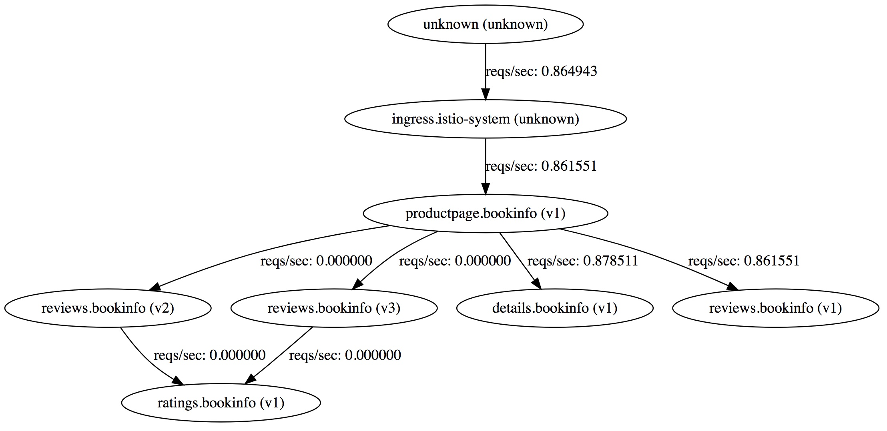
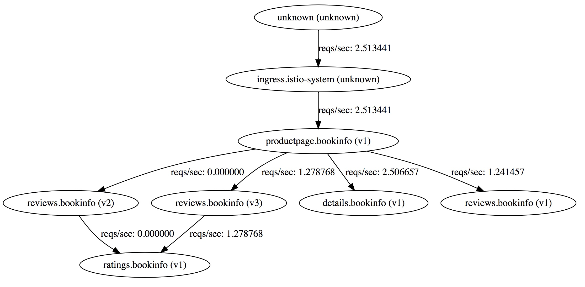

# Traffic Shifting - AB testing

In this lab, we will learn to shift specific amount of traffic to specific version of a service not by changing code but just by using routing rules. Note that this feature is available in OpenShift router by default. However, Istio enables this for services that may not not have been exposed to the router.

### Pre-Requisites

Default rules were setup to redirect all the traffic to version 1 by running `oc create -f samples/bookinfo/kube/route-rule-all-v1.yaml`. To verify run the following

```
$ oc get routerule
NAME                  KIND
details-default       RouteRule.v1alpha2.config.istio.io
productpage-default   RouteRule.v1alpha2.config.istio.io
ratings-default       RouteRule.v1alpha2.config.istio.io
reviews-default       RouteRule.v1alpha2.config.istio.io
```

### Exercise

The default route rule for reviews page sends all the traffic to review service version 1 as shown below.

```
$ oc get routerule reviews-default -o yaml
apiVersion: config.istio.io/v1alpha2
kind: RouteRule
metadata:
  clusterName: ""
  creationTimestamp: 2017-11-14T17:54:24Z
  deletionGracePeriodSeconds: null
  deletionTimestamp: null
  name: reviews-default
  namespace: bookinfo
  resourceVersion: "101977"
  selfLink: /apis/config.istio.io/v1alpha2/namespaces/bookinfo/routerules/reviews-default
  uid: d99590a8-c964-11e7-8511-4a87e5bc1e5e
spec:
  destination:
    name: reviews
  precedence: 1
  route:
  - labels:
      version: v1
```

Use the application a few times and notice the service graph. You can find the url for service graph by running

```
$ oc get route servicegraph -n istio-system
NAME           HOST/PORT                                       PATH      SERVICES       PORT      TERMINATION   WILDCARD
servicegraph   servicegraph-istio-system.192.168.64.7.nip.io             servicegraph   http                    None
```
You would add `/dotviz` to access service graph at `http://servicegraph-istio-system.192.168.64.7.nip.io/dotviz` and notice all traffic goes to reviews v1 that does not connect to ratings service and requests to other versions of reviews are 0.



Now, we will replace the default routerule for reviews service to share the traffic across versions reviews v1 (that does not connect to the ratings service) and reviews v3 (that connects to the ratings service and displays the starts in red).
 
**Note** we are using `replace` instead of `create` as we are replacing the existing routerule (not adding a new one).

See the description of the route rule on how it distributes the traffic between versions v1 and v3 50% each.

```
$ oc replace -f samples/bookinfo/kube/route-rule-reviews-50-v3.yaml
routerule "reviews-default" replaced

$ oc get routerule reviews-default -o yaml
apiVersion: config.istio.io/v1alpha2
kind: RouteRule
metadata:
  clusterName: ""
  creationTimestamp: 2017-10-27T20:58:12Z
  generation: 0
  name: reviews-default
  namespace: bookinfo
  resourceVersion: "8266"
  selfLink: /apis/config.istio.io/v1alpha2/namespaces/bookinfo/routerules/reviews-default
  uid: 8bad146c-bb59-11e7-9c32-1ad90b5af171
spec:
  destination:
    name: reviews
  precedence: 1
  route:
  - labels:
      version: v1
    weight: 50
  - labels:
      version: v3
    weight: 50
```

Wait a few minutes until the service graph shows 0 requests/sec everywhere. If you havent used it in a while it will be all 0s.

Let's now test the app again by pumping some load

```
$ for i in {1..100}; do curl http://istio-ingress-istio-system.127.0.0.1.nip.io/productpage; done
```

Notice that the traffic being split would be approximately equal between reviews v1 and v3 on the service graph as shown below. There wouldn't be any traffic to reviews v2. 


**Clean up**

Reset the default routing rules to redirect all traffic to  v1

```
$ oc replace -f samples/bookinfo/kube/route-rule-all-v1.yaml
routerule "productpage-default" replaced
routerule "reviews-default" replaced
routerule "ratings-default" replaced
routerule "details-default" replaced

```
Test to make sure your app is reaching all version 1 services.

 
Now we are ready for the next lab.

### Summary
In this lab we observed how we can shift traffic by using traffic rules. The example above was AB Testing. 