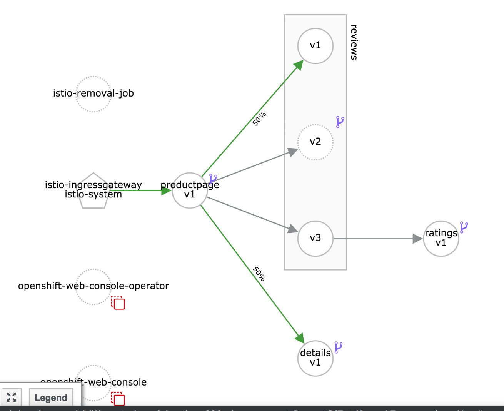
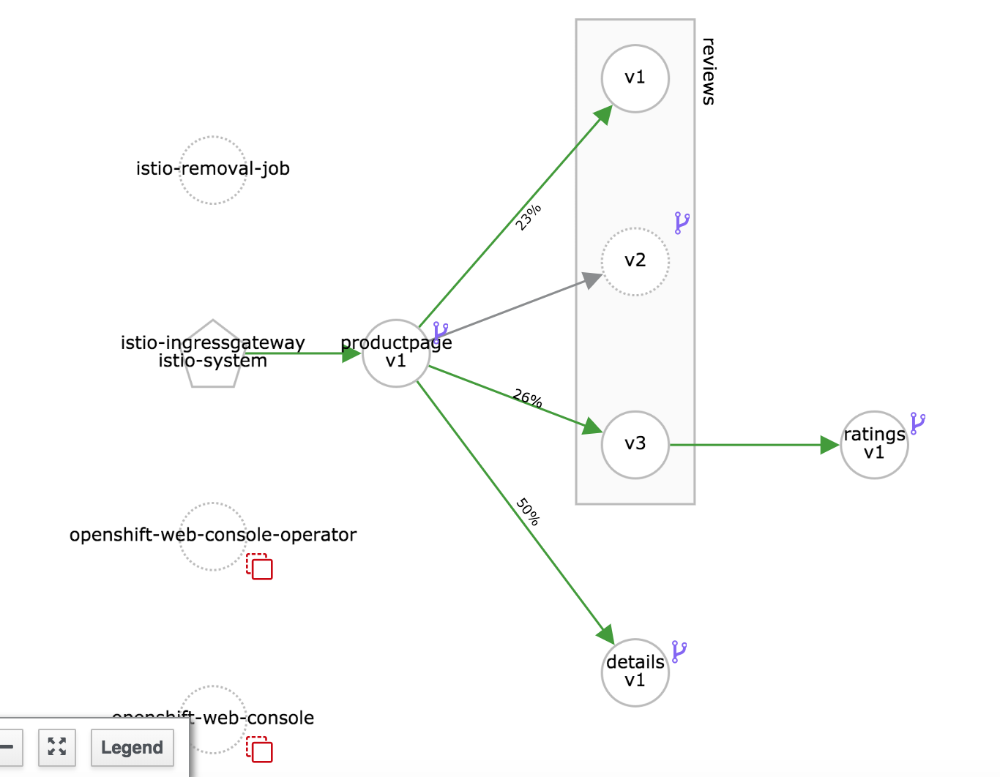
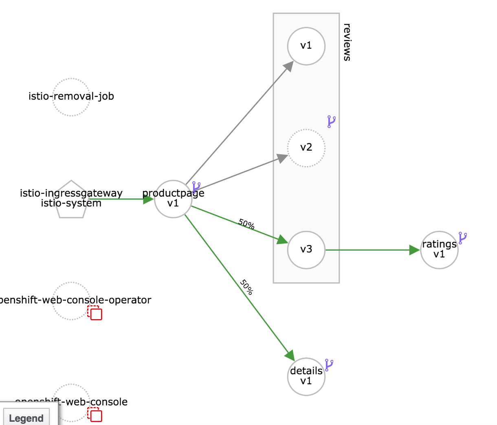

# Traffic Shifting - AB testing

In this lab, we will learn to shift specific amount of traffic to specific version of a service not by changing code but just by using routing rules. Note that this feature is available in OpenShift router by default. However, Istio enables this for services that may not not have been exposed via the router.

### Pre-Requisites

* A running Istio Cluster
* Sample BookInfo Application deployed
* Destination rules created

## Traffic to V1

Route all the traffic is routed to version 1 by default as before by running

```
 kubectl apply -f samples/bookinfo/networking/virtual-service-all-v1.yaml
```

On the Kiali Service Graph, click on `Graph Settings` dropdown and select the check box to show `Request Percent of Total`. This will be useful for us to measure the amount of traffic flowing to specific version.

Use the application a few times to find **no stars** for ratings. Also check the Kiali service graph. You will notice that all the traffic is going to reviews version v1 as below. 



## AB Testing with 50% Split

Now, we will replace the default routing rule for reviews virtual service to share the traffic across versions reviews v1 (that does not connect to the ratings service) and reviews v3 (that connects to the ratings service and displays the starts in red).

See the description of the virtual service on how it distributes the traffic between versions v1 and v3 50% each.

```
$ cat samples/bookinfo/networking/virtual-service-reviews-50-v3.yaml
apiVersion: networking.istio.io/v1alpha3
kind: VirtualService
metadata:
  name: reviews
spec:
  hosts:
    - reviews
  http:
  - route:
    - destination:
        host: reviews
        subset: v1
      weight: 50
    - destination:
        host: reviews
        subset: v3
      weight: 50
```

Now let's apply this routing rule by running

```
kubectl apply -f samples/bookinfo/networking/virtual-service-reviews-50-v3.yaml
```

Wait a few minutes until the service graph shows grey lines (0 requests/sec) everywhere. If you havent used it in a while it will be all grey.

Let's now test the app again by pumping some load

```
export URL=$(kubectl get route istio-ingressgateway -n istio-system -o yaml -o jsonpath={.spec.host})
```

Let us send 100 requests
```
for i in {1..100}; do curl -o /dev/null -s -w "%{http_code}\n" http://${URL}/productpage; done
```

> **Note** If you are using a header `Host: bookinfo1.istio.apps.devday.ocpcloud.com` then you would want to include header in the curl as well, as shown below (substitute your own hostname)
>`for i in {1..100}; do curl -o /dev/null -s -w "%{http_code}\n" -H "Host: bookinfo1.istio.apps.devday.ocpcloud.com" http://${URL}/productpage; done` 


Notice that the traffic being split would be approximately equal between reviews v1 and v3 on the service graph as shown below. There wouldn't be any traffic to reviews v2. 


If you refresh the product page in the browser you will see **red stars** approximately 50% of the times you clicked. The rest 50% you will see **no stars**.

## 100% to V3

Next let's apply the following rule to route the traffic to reviews v3 100% of the time

```
kubectl apply -f samples/bookinfo/networking/virtual-service-reviews-v3.yaml
```

Now you will see all the traffic going to reviews v3 and you will always see **red stars** on the page.


### Cleanup

To clean up, remove the routing rules by deleting the virtual services created earlier.

```
kubectl delete -f samples/bookinfo/networking/virtual-service-all-v1.yaml
```

### Summary
In this lab we observed how we can shift traffic by using traffic rules. The example above was AB Testing. 