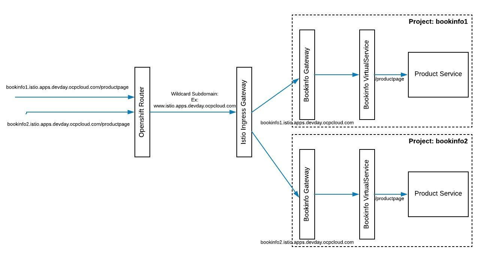

# Controlling Ingress Traffic


### Prerequisites

* A running Istio Cluster
* Sample BookInfo Application deployed
* Gateway and VirtualService created


### Understanding Ingress

Let us revisit the our bookinfo Gateway and VirtualService once more. 

Run the following command to display the gateway details

```
kubectl get gateway bookinfo-gateway -o yaml
```
It displays the output similar to the following:

```
kind: Gateway
metadata:
  annotations:
    kubectl.kubernetes.io/last-applied-configuration: |
      {"apiVersion":"networking.istio.io/v1alpha3","kind":"Gateway","metadata":{"annotations":{},"name":"bookinfo-gateway","namespace":"bookinfo20"},"spec":{"selector":{"istio":"ingressgateway"},"servers":[{"hosts":["bookinfo20.istio.apps.311.ocpcloud.com"],"port":{"name":"http","number":80,"protocol":"HTTP"}}]}}
  creationTimestamp: 2018-12-18T00:54:17Z
  generation: 1
  name: bookinfo-gateway
  namespace: bookinfo20
  resourceVersion: "10829011"
  selfLink: /apis/networking.istio.io/v1alpha3/namespaces/bookinfo20/gateways/bookinfo-gateway
  uid: 724ad343-025f-11e9-820c-06c81d37223e
spec:
  selector:
    istio: ingressgateway
  servers:
  - hosts:
    - bookinfo1.istio.apps.devday.ocpcloud.com
    port:
      name: http
      number: 80
      protocol: HTTP
```

Note the `hosts` parameter configured to the route assigned to your application. In your case, it will be the route given to you.


Run the following command to display the virtual service details

```
kubectl get virtualservice bookinfo -o yaml
```

It displays the output similar to the following:

```
apiVersion: networking.istio.io/v1alpha3
kind: VirtualService
metadata:
  annotations:
    kubectl.kubernetes.io/last-applied-configuration: |
      {"apiVersion":"networking.istio.io/v1alpha3","kind":"VirtualService","metadata":{"annotations":{},"name":"bookinfo","namespace":"bookinfo20"},"spec":{"gateways":["bookinfo-gateway"],"hosts":["bookinfo20.istio.apps.311.ocpcloud.com"],"http":[{"match":[{"uri":{"exact":"/productpage"}},{"uri":{"exact":"/login"}},{"uri":{"exact":"/logout"}},{"uri":{"prefix":"/api/v1/products"}}],"route":[{"destination":{"host":"productpage","port":{"number":9080}}}]}]}}
  creationTimestamp: 2018-12-18T00:54:19Z
  generation: 1
  name: bookinfo
  namespace: bookinfo20
  resourceVersion: "10829950"
  selfLink: /apis/networking.istio.io/v1alpha3/namespaces/bookinfo20/virtualservices/bookinfo
  uid: 73d16f56-025f-11e9-820c-06c81d37223e
spec:
  gateways:
  - bookinfo-gateway
  hosts:
  - bookinfo1.istio.apps.devday.ocpcloud.com
  http:
  - match:
    - uri:
        exact: /productpage
    - uri:
        exact: /login
    - uri:
        exact: /logout
    - uri:
        prefix: /api/v1/products
    route:
    - destination:
        host: productpage
        port:
          number: 9080
```

The ingress routing rules are configured on this virtual service to allow traffic from bookinfo-gateway for the hostname defined for your application. Refer the `gateways` and `hosts` paramters.

On the Openshift cluster, I have exposed a wildcard domain on the cluster via the OpenShift router. This is configured as an example,  `www.istio.apps.devday.ocpcloud.com` which also means that it accepts any traffic coming to `*.istio.apps.devday.ocpcloud.com`. So any traffic coming to `bookinfo1.istio.apps.devday.ocpcloud.com` is caught by this wildcard route and is directed to the `bookinfo-gateway` configured in your project to listen for the host name `bookinfo1.istio.apps.devday.ocpcloud.com` . From there the traffic gets directed to the `bookinfo` virtual service with the above matching. Figure below shows how Ingress works with OpenShift router and Wildcard Subdomain. Virtual service is where you can configure the ingress routing rules.

Figure below shows the ingress mechanism.




### Ingress rules in the Virtual Service

Note the http matching configured in the VirtualService. Specifically we will play around with this match

```
    - uri:
        prefix: /api/v1/products
```

The current match shows that you can call any APIs that are prefixed as `api/v1/products`.

Let us try  `curl http://bookinfo1.istio.apps.devday.ocpcloud.com/api/v1/products` you should see output as shown the below with product information.

```

[{"descriptionHtml": "<a href=\"https://en.wikipedia.org/wiki/The_Comedy_of_Errors\">Wikipedia Summary</a>: The Comedy of Errors is one of <b>William Shakespeare's</b> early plays. It is his shortest and one of his most farcical comedies, with a major part of the humour coming from slapstick and mistaken identity, in addition to puns and word play.", "id": 0, "title": "The Comedy of Errors"}]

```

Note the product's ` "id": 0`. We will use this id to call other APIs. Let us use our prefix and get reviews

`curl http://bookinfo20.istio.apps.311.ocpcloud.com/api/v1/products/0/reviews`

and observe the output similar to 

```
{"reviews": [{"reviewer": "Reviewer1", "rating": {"color": "red", "stars": 5}, "text": "An extremely entertaining play by Shakespeare. The slapstick humour is refreshing!"}, {"reviewer": "Reviewer2", "rating": {"color": "red", "stars": 4}, "text": "Absolutely fun and entertaining. The play lacks thematic depth when compared to other plays by Shakespeare."}], "id": "0"}
```

and ratings service by running

`curl http://bookinfo20.istio.apps.311.ocpcloud.com/api/v1/products/0/ratings`

to observe output similar to

```
{"ratings": {"Reviewer2": 4, "Reviewer1": 5}, "id": 0}
```

Now let us edit this match criteria. We will replace `prefix: /api/v1/products` with `exact: /api/v1/products`. This means the URL will be matched exactly with `/api/v1/products` which means no other URLs should work.

Run the following command to apply this change.
> **Note** Substitute the hostname with your own value

```
cat <<EOF | kubectl apply -f -
apiVersion: networking.istio.io/v1alpha3
kind: VirtualService
metadata:
  name: bookinfo
spec:
  hosts:
  - "bookinfo1.istio.apps.devday.ocpcloud.com"
  gateways:
  - bookinfo-gateway
  http:
  - match:
    - uri:
        exact: /productpage
    - uri:
        exact: /login
    - uri:
        exact: /logout
    - uri:
        exact: /api/v1/products
    route:
    - destination:
        host: productpage
        port:
          number: 9080
EOF
```

Let us test again

1. `curl http://bookinfo20.istio.apps.311.ocpcloud.com/api/v1/products` should work
2. `curl http://bookinfo20.istio.apps.311.ocpcloud.com/api/v1/products/0/reviews -I` should give a `404`
3. `curl http://bookinfo20.istio.apps.311.ocpcloud.com/api/v1/products/0/ratings -I` should also give a `404`

### Clean up

Restore the VirtualService back to its original state by running:

```
sed "s/*/$APPHOSTNAME/" samples/bookinfo/networking/bookinfo-gateway.yaml | kubectl apply -f - 

```


