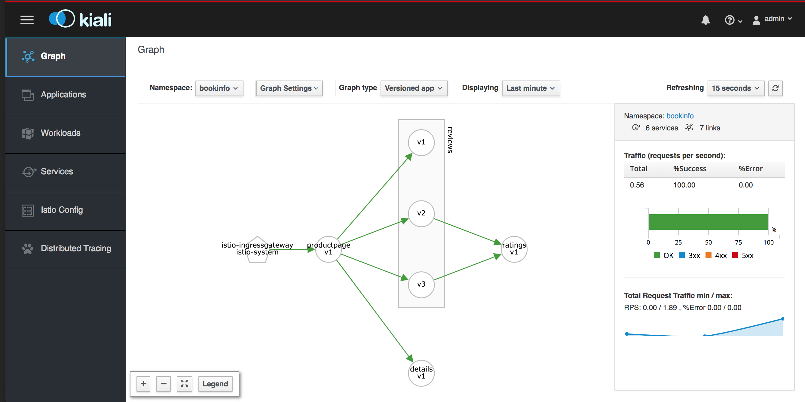
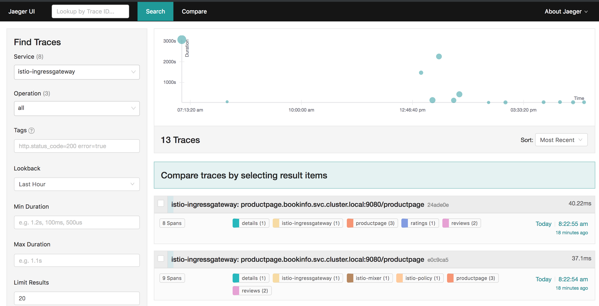
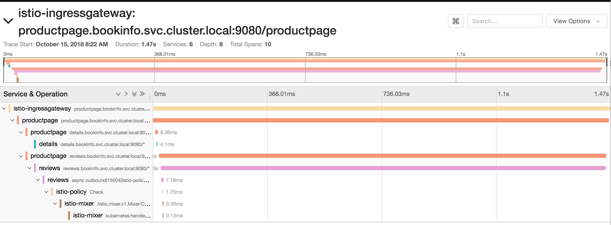

# Deploying sample application

>**Note**: You could be running these labs from Minishift or an OpenShift cluster. There are slight variations based which environment you are using. As an example, project names will be different in order to make them unique in a multi-user OpenShift cluster as opposed to using a single user minishift. Those changes have been documented. So please read carefully before executing the commands.

### Prerequisites

* Istio is installed and running on either Minishift or OpenShift.
* Your administrator has assigned you a userid to run these samples. If you are using minishift, you have provided necessary access to the user `developer`.
* A project has been created, and istio-injection enabled, the `default` service account has been given access for Istio
* If running on OpenShift, your administrator has given you a hostname to use with your application instance.

### Download Istio Samples

While we are already running Istio, let us do some extra steps to get the samples and istio cli downloaded to our box. 

You can download Istio binaries and samples corresponding to your OS from here [https://github.com/istio/istio/releases](https://github.com/istio/istio/releases) 

If you are using Mac or Linux you can run the following command that will extract the latest release automatically

```
curl -L https://git.io/getLatestIstio | sh -
```

I am testing with Istio version `1.0.2`. 

Change over to the folder where Istio samples are downloaded 
```
cd istio-1.0.2
```

When you list the files you should see this

```
$ ls
LICENSE		bin		istio.VERSION	tools
README.md	install		samples
```
This is where you will execute all subsequent commands for application deployment from.

Set the path to `istioctl` binary or copy to a location where it can run. As an example on Mac, I am copying istioctl to `/usr/local/bin` so that I can run this command. Verify running `istioctl version`.

```
$ cp bin/istioctl /usr/local/bin

$ which istioctl
/usr/local/bin/istioctl

$ istioctl version
Version: 1.0.2
GitRevision: d639408fded355fb906ef2a1f9e8ffddc24c3d64
User: root@66ce69d4a51e
Hub: gcr.io/istio-release
GolangVersion: go1.10.1
BuildStatus: Clean
```


### Deploy Bookinfo sample application

We will deploy the sample bookinfo application explained in the [istiodocs](https://istio.io/docs/guides/bookinfo.html). The instructions are more or less the same as kubernetes with some slight variations. Hence I have documented the openshift deployment process here.


Login with the userid (such as `user1`) assigned to you by the administrator. If you are using minishift you will login as `developer` by running the following command.

> **Note** substitute the userid assigned to you.

```
oc login -u developer
```

Now if you list the projects you should see access to a `bookinfo` project and `istio-system` project. If you are running on OpenShift, the bookinfo project may be named differently based on your userid. Example: `bookinfo1` if you are `user1`  to make it unique to each user.

```
$ oc get projects
NAME           DISPLAY NAME   STATUS
bookinfo                      Active
istio-system                  Active
...
...

```

Switch your context to bookinfo project assigned to you by running a command like:

> **Note** Change the project name to the one assigned to you

```
oc project bookinfo
```

Let's now deploy the `bookinfo` application. We are using `istioctl kube-inject` to add `Envoy` sidecar proxies to each of the kubernetes deployment yamls and using the resultant deployment yamls to create an application.

```
kubectl apply -f <(istioctl kube-inject -f samples/bookinfo/platform/kube/bookinfo.yaml)
```
> **Note** you are in the folder where you downloaded Istio samples.

and watch the output as shown below

```
service/details created
deployment.extensions/details-v1 created
service/ratings created
deployment.extensions/ratings-v1 created
service/reviews created
deployment.extensions/reviews-v1 created
deployment.extensions/reviews-v2 created
deployment.extensions/reviews-v3 created
service/productpage created
deployment.extensions/productpage-v1 created
```

Give a few mins for the container images to be pulled and for the pods to come up. Note all the components that are running.

```
$ kubectl get po
NAME                              READY     STATUS            RESTARTS   AGE
details-v1-5c6798dd8d-dbbbj       0/2       PodInitializing   0          33s
productpage-v1-6645b8588d-ztxpb   0/2       PodInitializing   0          29s
ratings-v1-86d8c8dfcb-rqxsx       0/2       PodInitializing   0          33s
reviews-v1-94b6b6b9d-4qhsx        0/2       PodInitializing   0          33s
reviews-v2-5d6498bd56-v5cxv       0/2       PodInitializing   0          32s
reviews-v3-76db6df594-927q6       0/2       PodInitializing   0          31s

$ kubectl get services
NAME          TYPE        CLUSTER-IP       EXTERNAL-IP   PORT(S)    AGE
details       ClusterIP   172.30.4.163     <none>        9080/TCP   30s
productpage   ClusterIP   172.30.247.217   <none>        9080/TCP   28s
ratings       ClusterIP   172.30.119.188   <none>        9080/TCP   30s
reviews       ClusterIP   172.30.142.212   <none>        9080/TCP   29s
```

### Create a Gateway to access your application

In order to make your application accessible from outside the cluster, an [Istio Gateway](https://istio.io/docs/concepts/traffic-management/#gateways) is required. Let us understand gateway and virtual service configurations

```
$ cat samples/bookinfo/networking/bookinfo-gateway.yaml
apiVersion: networking.istio.io/v1alpha3
kind: Gateway
metadata:
  name: bookinfo-gateway
spec:
  selector:
    istio: ingressgateway # use istio default controller
  servers:
  - port:
      number: 80
      name: http
      protocol: HTTP
    hosts:
    - "*"
---
apiVersion: networking.istio.io/v1alpha3
kind: VirtualService
metadata:
  name: bookinfo
spec:
  hosts:
  - "*"
  gateways:
  - bookinfo-gateway
  http:
  - match:
    - uri:
        exact: /productpage
    - uri:
        exact: /login
    - uri:
        exact: /logout
    - uri:
        prefix: /api/v1/products
    route:
    - destination:
        host: productpage
        port:
          number: 9080

```
**Gateway**: A [Gateway](https://istio.io/docs/reference/config/istio.networking.v1alpha3/#Gateway) configures a load balancer for HTTP/TCP traffic, most commonly operating at the edge of the mesh to enable ingress traffic for an application. The above gateway will direct all the `HTTP` traffic coming on port `80` at istio-ingressgateway to the bookinfo sample application. 

* The selector `istio: ingressgateway` pull the traffic coming to istio-ingressgateway service in the `istio-system` project 
* The parameter `hosts: "*"` says that any traffic coming to this `bookinfo-gateway` for any hostname will be consumed. If we want our application to cater to specific hostnames, we should list those here instead of using `*`
 
**VirtualService**: A [VirtualService](https://istio.io/docs/reference/config/istio.networking.v1alpha3/#VirtualService) defines the rules that control how requests for a service are routed within an Istio service mesh. With the above virtualservice configuration:

* `gateways: - bookinfo-gateway` configures it to listens to traffic coming to `bookinfo-gateway` defined earlier
* `host: "*"` caters to any hostnames. If we want specific hostname, we can change this to a specific hostname.
* URI matching allows it to listen to `/productpage` etc.

-----
#### Minishift
To deploy with minishift, since it is not multi-tenant you can just deploy the gateway and a virtual service as shown below:

```
$ kubectl apply -f samples/bookinfo/networking/bookinfo-gateway.yaml
gateway.networking.istio.io/bookinfo-gateway created
virtualservice.networking.istio.io/bookinfo created
```
The virtual service above shows that we can access product page at `/productpage` endpoint. This endpoint is for the Istio ingress i.e.,

```
$ kubectl get route -n istio-system istio-ingressgateway
NAME                   HOST/PORT                                                PATH      SERVICES               PORT      TERMINATION   WILDCARD
istio-ingressgateway   istio-ingressgateway-istio-system.192.168.64.72.nip.io             istio-ingressgateway   http2                   None
```

-----

-----
#### OpenShift
To deploy on a multi-user OpenShift cluster, since you want a separate URL for each application instance, 

**Ask your organizer for the Hostname to assign to your application.**<br>
**Ask your organizer for the Hostname to assign to your application.**<br>
**Ask your organizer for the Hostname to assign to your application.**<br>
**Ask your organizer for the Hostname to assign to your application.**<br>
**Ask your organizer for the Hostname to assign to your application.**<br>

If you are `user1` you will be allocated a url such as `bookinfo1.istio.apps.devday.ocpcloud.com`. The domain name may vary. Similarly `user2` may get `bookinfo2`.

> **Substitute** the value in the command below before running:

The command below will change assign a specific hostname in place of `*`, before creating gateway and virtual service for your application.
 
```
sed "s/*/bookinfo1.istio.apps.devday.ocpcloud.com/" samples/bookinfo/networking/bookinfo-gateway.yaml | kubectl apply -f - 
```
You will see the following configurations for gateway and virtualservice. Look at the `hosts` parameters. 

```
$ kubectl get gateway bookinfo-gateway -o yaml
apiVersion: networking.istio.io/v1alpha3
kind: Gateway
metadata:
  annotations:
    kubectl.kubernetes.io/last-applied-configuration: |
      {"apiVersion":"networking.istio.io/v1alpha3","kind":"Gateway","metadata":{"annotations":{},"name":"bookinfo-gateway","namespace":"bookinfo1"},"spec":{"selector":{"istio":"ingressgateway"},"servers":[{"hosts":["bookinfo1.istio.apps.devday.ocpcloud.com"],"port":{"name":"http","number":80,"protocol":"HTTP"}}]}}
  clusterName: ""
  creationTimestamp: 2018-10-18T01:01:17Z
  generation: 1
  name: bookinfo-gateway
  namespace: bookinfo1
  resourceVersion: "4500380"
  selfLink: /apis/networking.istio.io/v1alpha3/namespaces/bookinfo1/gateways/bookinfo-gateway
  uid: 517d308a-d271-11e8-900a-069c4762f7ea
spec:
  selector:
    istio: ingressgateway
  servers:
  - hosts:
    - bookinfo1.istio.apps.devday.ocpcloud.com
    port:
      name: http
      number: 80
      protocol: HTTP
      
      
-----

$ kubectl get virtualservice bookinfo -o yaml
apiVersion: networking.istio.io/v1alpha3
kind: VirtualService
metadata:
  annotations:
    kubectl.kubernetes.io/last-applied-configuration: |
      {"apiVersion":"networking.istio.io/v1alpha3","kind":"VirtualService","metadata":{"annotations":{},"name":"bookinfo","namespace":"bookinfo1"},"spec":{"gateways":["bookinfo-gateway"],"hosts":["bookinfo1.istio.apps.devday.ocpcloud.com"],"http":[{"match":[{"uri":{"exact":"/productpage"}},{"uri":{"exact":"/login"}},{"uri":{"exact":"/logout"}},{"uri":{"prefix":"/api/v1/products"}}],"route":[{"destination":{"host":"productpage","port":{"number":9080}}}]}]}}
  clusterName: ""
  creationTimestamp: 2018-10-18T01:01:17Z
  generation: 1
  name: bookinfo
  namespace: bookinfo1
  resourceVersion: "4500381"
  selfLink: /apis/networking.istio.io/v1alpha3/namespaces/bookinfo1/virtualservices/bookinfo
  uid: 51a76501-d271-11e8-900a-069c4762f7ea
spec:
  gateways:
  - bookinfo-gateway
  hosts:
  - bookinfo1.istio.apps.devday.ocpcloud.com
  http:
  - match:
    - uri:
        exact: /productpage
    - uri:
        exact: /login
    - uri:
        exact: /logout
    - uri:
        prefix: /api/v1/products
    route:
    - destination:
        host: productpage
        port:
          number: 9080

```

In order to access this application from outside the cluster you will use `bookinfo1.istio.apps.devday.ocpcloud.com`. 

So how does the routing work?

We have a wildcard route exposed for `istio-ingressgateway` service on our openshift cluster. In my case it was `www.istio.apps.devday.ocpcloud.com` with `wildcardPolicy: Subdomain`. This means when we access any hostname `*.istio.apps.devday.ocpcloud.com`, it will be listened to by the `istio-ingressgateway` service. Based on the gateway and virtualservice configurations discussed above, the traffic will land in your application. 

To summarize the routing:

`Client` --> `OpenShiftRouter`--> `istio-ingressgateway`-->`bookinfo-gateway`--> `bookinfo virtualservice`--> `productpage`

* OpenShift router receives the traffic for the default domain (in my case `*.apps.devday.ocpcloud.com`)
* Istio-ingressgateway service receives the traffic via wildcard route (in my case it is configured for `www.istio.apps.devday.ocpcloud.com` means it receives any `*.istio.apps.devday.ocpcloud.com`)
* `bookinfo-gateway` receives traffic for specific application hostname (in the above case `bookinfo1.istio.apps.devday.ocpcloud.com`)
* `bookinfo virtualservice` redirects the traffic to specific endpoints exposed by the application.

-----


> **Note** Your URLs would be different from mine. So use your values. If you want  to know your URLs run `kubectl get route -n istio-system`

Save this URL as an environment variable

```
export URL=$(kubectl get route istio-ingressgateway -n istio-system -o yaml -o jsonpath={.spec.host})
```
So I can access the product page at the URL [http://${URL}/productpage](http://${URL}/productpage). 

Familiarize with this application a little bit. Use it a few times. 

### Service Graph

Check the service graph on kiali at [https://kiali-istio-system.192.168.64.72.nip.io](https://kiali-istio-system.192.168.64.72.nip.io)
You can use the `Graph` menu item on the left of Kiala to view this graph as below: *Use your own URL*


Right next to the service graph, you will see a summary of the traffic success and error rates which gives you a snapshot of the health of your microservices running on the platform

### Application Metrics

Click on the `Applications` menu to get an application centric view of different microservices, their health/error rate and their inbound and outbound metrics such as `Request Volume`, `Request Duration`, `Request Size`, `Response Size` etc.
These are helpful for debugging your microservices as you use them further.

You'll get similar information using `Workloads` menu item, where the viewpoint is based on kubernetes deployments rather than applications.

Yet another view is provided based on Kubernetes Services with the `Services` menu item.

### Tracing

Click on `Distributed Tracing	` on the Kiali menu to connect to Jaeger. 

> **Note** If you are not getting redirected to Jaeger, you may have to enable popups from Kiali page

Jaeger provides tracing info for all the calls you made. Select a service on the left hand menu such as `istio-ingressgateway` or `productpage` and you will see the list of traces for all your usage.



You can compare these traces by selecting a few of them, or you can select a particular trace by clicking on one of them and look at the response times as shown below.




### Monitoring

Also notice the data collected by Prometheus and displayed on Grafana at [http://grafana-istio-system.192.168.64.72.nip.io/d/LJ_uJAvmk/istio-service-dashboard](http://grafana-istio-system.192.168.64.72.nip.io/d/LJ_uJAvmk/istio-service-dashboard) *Use your own URL*


### Destination Rules

We have the Bookinfo application running now. Let's apply some destination rules  from the file `samples/bookinfo/networking/destination-rule-all-mtls.yaml` that will allow us to shape traffic according to the subsets we define in these rules. 

A [DestinationRule](https://istio.io/docs/reference/config/istio.networking.v1alpha3/#DestinationRule) configures the set of policies to be applied to a request after VirtualService routing has occurred.

Let us first look at these destination rules. These are four rules applies to **productpage**, **reviews**, **ratings** and **details**. The rules define subsets based on the *version* labels. These subsets will be used in the future labs for traffic shaping. 

```
$ cat samples/bookinfo/networking/destination-rule-all.yaml
apiVersion: networking.istio.io/v1alpha3
kind: DestinationRule
metadata:
  name: productpage
spec:
  host: productpage
  subsets:
  - name: v1
    labels:
      version: v1
---
apiVersion: networking.istio.io/v1alpha3
kind: DestinationRule
metadata:
  name: reviews
spec:
  host: reviews
  subsets:
  - name: v1
    labels:
      version: v1
  - name: v2
    labels:
      version: v2
  - name: v3
    labels:
      version: v3
---
apiVersion: networking.istio.io/v1alpha3
kind: DestinationRule
metadata:
  name: ratings
spec:
  host: ratings
  subsets:
  - name: v1
    labels:
      version: v1
  - name: v2
    labels:
      version: v2
  - name: v2-mysql
    labels:
      version: v2-mysql
  - name: v2-mysql-vm
    labels:
      version: v2-mysql-vm
---
apiVersion: networking.istio.io/v1alpha3
kind: DestinationRule
metadata:
  name: details
spec:
  host: details
  subsets:
  - name: v1
    labels:
      version: v1
  - name: v2
    labels:
      version: v2
---
```

Let us now apply these labels by running

```
kubectl apply -f samples/bookinfo/networking/destination-rule-all.yaml
```

Get back to Kiala menu option `Istio Config` on the left to find these destination rules. **Istio Config** can be used to view all the rules applied on the traffic at any point of time.


### Clean Up

> **Note** If you are proceeding with other labs, you don't run clean up. Just move ahead with the next lab.

In order to remove the BookInfo application deployed so far, run the following commands.

```
samples/bookinfo/platform/kube/cleanup.sh
```

or you can clean up the objects individually by running the following

```
kubectl -n bookinfo delete virtualservices --all 	# deletes all virtual services
kubectl -n bookinfo delete destinationrules --all 	# delete all destination rules
kubectl -n bookinfo delete gateway --all 	# deletes all gateways
kubectl -n bookinfo delete -f samples/bookinfo/platform/kube/bookinfo.yaml 	# deletes all services and deployments
kubectl -n bookinfo delete rs --all 			# deletes all replica sets
kubectl -n bookinfo delete pods --all 		# deletes all pods
```


### Summary

In this chapter

* We have deployed our sample Bookinfo application and tested it
* Created a gateway and virtualservice to reach the application. 
* Added destination rules to set up routing rules later
* We also looked at how to monitor and trace this application using Istio's supported services


