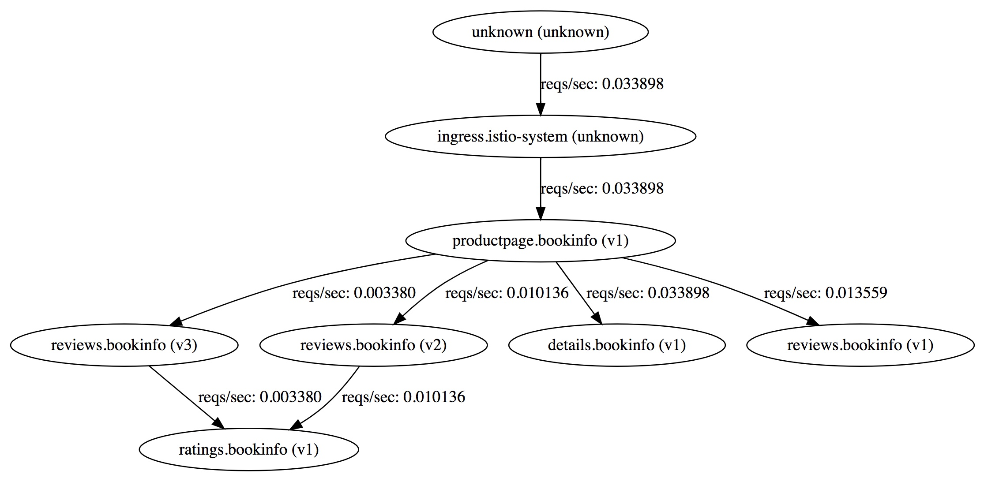

# Deploying sample application

We will deploy the sample bookinfo application explained in the istiodocs [https://istio.io/docs/guides/bookinfo.html](https://istio.io/docs/guides/bookinfo.html). The instructions are more or less the same as kubernetes with some slight variations. Hence I have documented the openshift deployment process here.

Create a new project for the application

```
$ oc new-project bookinfo
Now using project "bookinfo" on server "https://127.0.0.1:8443".

You can add applications to this project with the 'new-app' command. For example, try:

    oc new-app centos/ruby-22-centos7~https://github.com/openshift/ruby-ex.git

to build a new example application in Ruby.
```

When we install the bookinfo application, the application pods have init containers whose `proxy_init` runs in privileged mode and adds `NET_ADMIN`
as shown here. You will find this in the individual `deployment` artifacts.

```
initContainers:
      - args:
        - -p
        - "15001"
        - -u
        - "1337"
        image: docker.io/istio/proxy_init:0.2.7
        imagePullPolicy: IfNotPresent
        name: istio-init
        resources: {}
        securityContext:
          capabilities:
            add:
            - NET_ADMIN
          privileged: true
```
These application pods current run as `default` service account in a project. Hence we have to provide `privileged` access to the `default` account. Eventually, these examples should change to not require privileged access. But in the meanwhile, here is how you can set `default` service account to `privileged` security context constraint (scc) in the `bookinfo` project/namespace.

```
$ oc adm policy add-scc-to-user privileged -z default -n bookinfo
```

Let's now deploy the `bookinfo` application. We are using `istioctl kube-inject` to add `Envoy` sidecar proxies to each of the kubernetes deployment yamls and using the resultant deployment yamls to create an application.

```
$ oc apply -f <(istioctl kube-inject -f samples/bookinfo/kube/bookinfo.yaml)
service "details" created
deployment "details-v1" created
service "ratings" created
deployment "ratings-v1" created
service "reviews" created
deployment "reviews-v1" created
deployment "reviews-v2" created
deployment "reviews-v3" created
service "productpage" created
deployment "productpage-v1" created
ingress "gateway" created
```

Give a few mins for the container images to be pulled and for the pods to come up. Note all the components that are running.

```
$ oc get pods
NAME                              READY     STATUS     RESTARTS   AGE
details-v1-1597718389-zztwb       0/2       Init:0/2   0          3m
productpage-v1-2620897829-1557j   0/2       Init:0/2   0          3m
ratings-v1-3229318905-5klb7       0/2       Init:0/2   0          3m
reviews-v1-359063641-xwd16        0/2       Init:0/2   0          3m
reviews-v2-1816415585-jd63g       0/2       Init:0/2   0          3m
reviews-v3-1743560369-kf4bf       0/2       Init:0/2   0          3m

$ oc get svc
NAME          CLUSTER-IP       EXTERNAL-IP   PORT(S)    AGE
details       172.30.37.29     <none>        9080/TCP   2m
productpage   172.30.168.188   <none>        9080/TCP   2m
ratings       172.30.35.113    <none>        9080/TCP   2m
reviews       172.30.130.102   <none>        9080/TCP   2m

$ oc get ingress
NAME      HOSTS     ADDRESS          PORTS     AGE
gateway   *         172.29.101.193   80        2m
```

Note that there is an ingress gateway for this application. To understand this let us describe the ingress.

```
$ oc describe ingress
Name:			gateway
Namespace:		bookinfo
Address:		172.29.251.55
Default backend:	default-http-backend:80 (<none>)
Rules:
  Host	Path	Backends
  ----	----	--------
  *	
    	/productpage 		productpage:9080 (<none>)
    	/login 			productpage:9080 (<none>)
    	/logout 		productpage:9080 (<none>)
    	/api/v1/products 	productpage:9080 (<none>)
    	/api/v1/products/.* 	productpage:9080 (<none>)
Annotations:
Events:	<none>

```

It shows that we can access product page at `/productpage` extension. This extension is for the Istio ingress i.e.,

```
$ oc get route -n istio-system istio-ingress
NAME            HOST/PORT                                     PATH      SERVICES        PORT      TERMINATION   WILDCARD
istio-ingress   istio-ingress-istio-system.127.0.0.1.nip.io             istio-ingress   http                    None
```

So you can access the product page at the URL [http://istio-ingress-istio-system.127.0.0.1.nip.io/productpage](http://istio-ingress-istio-system.127.0.0.1.nip.io/productpage)

Familiarize with this application a little bit. Use it a few times. Go back an check the service graph at [http://servicegraph-istio-system.127.0.0.1.nip.io/dotviz](http://servicegraph-istio-system.127.0.0.1.nip.io/dotviz)
You will see that the graph as below:


Also notice the data collected by Prometheus and displayed on Grafana at [http://grafana-istio-system.127.0.0.1.nip.io/dashboard/db/istio-dashboard](http://grafana-istio-system.127.0.0.1.nip.io/dashboard/db/istio-dashboard)

We have application running now. It is now time to test the awesomeness of Istio.


