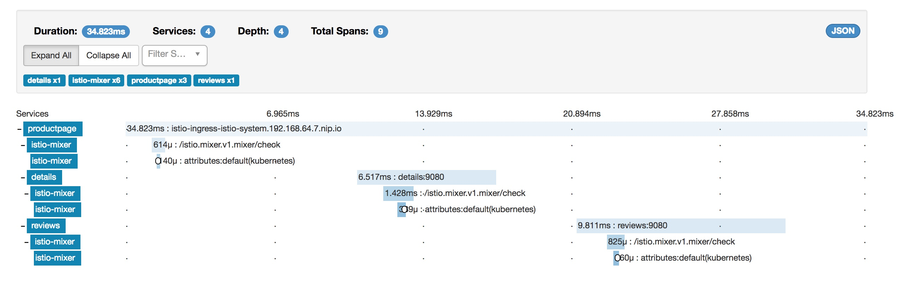
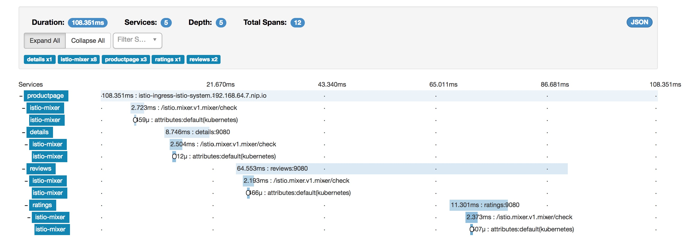
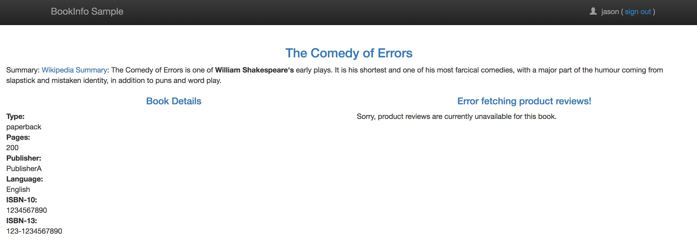
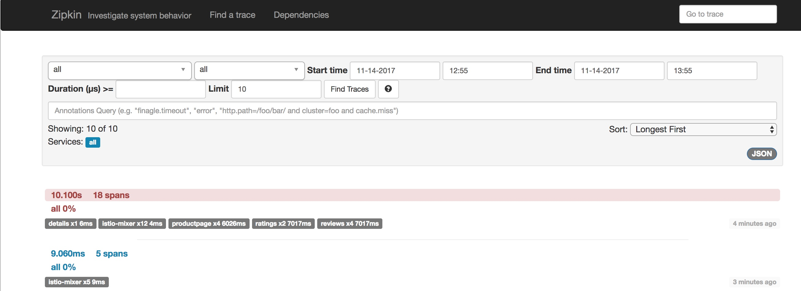
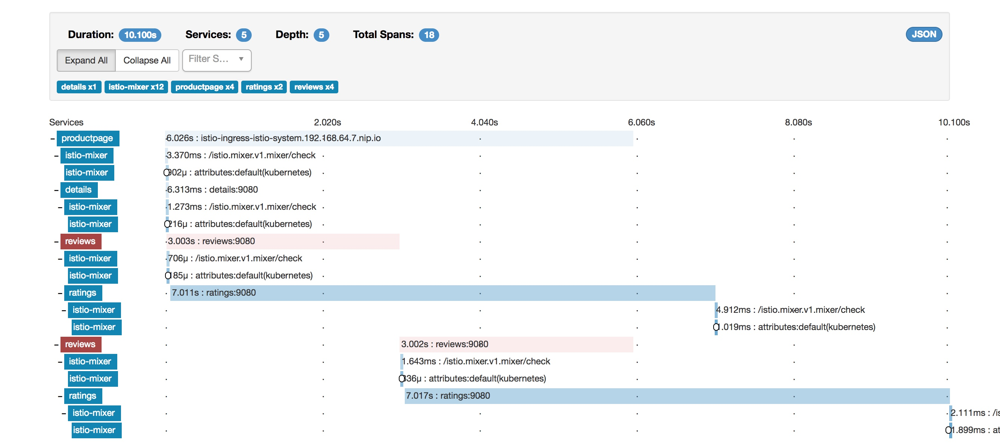

# Fault Injection
Fault injection is a mechanism where we will intentionally introduce a fault condition into a system and observe it's behavior.

In this example, we will observe what happens when we add some delay to mimic network latency into the ratings microservice. We will then observe the overall behavior of the system to check if still responds or will it cause failures other failures. 

### Pre-requisites

This is a followup after the [canary test](./CanaryContentBasedRouting.md). So if you haven't executed the canary test, you would want to include the default routing rules listed there.

Also sign-out from being the user "Jason"


### Exercise

Test the application in the browser and observe the response times in zipkin. In order to find the URL for zipkin run

```
$ oc get route zipkin -n istio-system 
NAME      HOST/PORT                                 PATH      SERVICES   PORT      TERMINATION   WILDCARD
zipkin    zipkin-istio-system.192.168.64.7.nip.io             zipkin     http                    None
```
In my case zipkin url is `zipkin-istio-system.192.168.64.7.nip.io`. Use that and find the response time for the latest usage. You will notice that the response time for the service is a few milliseconds. You can click and expand the trace and you will find the time consumed by individual services as shown here



Now login as user "Jason" and use the system and measure again. Click on the latest trace to expand. You'll find in the trace that the request goes from reviews service to ratings service. But the ratings service would just take a few milliseconds to respond. 



Now let's introduce some delay on the ratings service specifically for user "Jason". This rule introduces a fixed delay of 7 seconds on the ratings service for any traffic coming from Jason. If you see the rule, you will understand that we are introducing this delay using `httpFault`.


```
$ oc create -f samples/bookinfo/kube/route-rule-ratings-test-delay.yaml
routerule "ratings-test-delay" created

$ oc get routerule ratings-test-delay -o yaml
apiVersion: config.istio.io/v1alpha2
kind: RouteRule
metadata:
  clusterName: ""
  creationTimestamp: 2017-10-27T21:41:04Z
  deletionGracePeriodSeconds: null
  deletionTimestamp: null
  name: ratings-test-delay
  namespace: bookinfo
  resourceVersion: "7746"
  selfLink: /apis/config.istio.io/v1alpha2/namespaces/bookinfo/routerules/ratings-test-delay
  uid: 886157b9-bb5f-11e7-9c32-1ad90b5af171
spec:
  destination:
    name: ratings
  httpFault:
    delay:
      fixedDelay: 7s
      percent: 100
  match:
    request:
      headers:
        cookie:
          regex: ^(.*?;)?(user=jason)(;.*)?$
  precedence: 2
  route:
  - labels:
      version: v1
```


Now try accessing the application. The reviews part of the application fails with error "**Error Fetching Product Reviews**" as below:


Check zipkin tracing now again. The last one shows in red to represent failure.




The detailed trace shows that ratings service responded in ~7 seconds. But the reviews service failed in ~3 seconds and then it went for a retry. Even during the retry ratings responded after ~7 seconds and the reviews failed. This is because the timeout between the productpage and reviews service is less (3s + 1 retry = 6s total) than the timeout between the reviews and ratings service (10s)

Sign-out from "Jason" and test as a default user, the calls should go through fine with no errors.


**Edit the delay**

Let's now edit the delay to 2.8 seconds on the ratings service to see

```
$ oc edit routerule ratings-test-delay
```

Find this section in the editor
```
spec:
  destination:
    name: ratings
  httpFault:
    delay:
      fixedDelay: 7s
      percent: 100
```

Change it to 

```
spec:
  destination:
    name: ratings
  httpFault:
    delay:
      fixedDelay: 2.8s
      percent: 100
      
```
and save.

Test again signing in as user "jason". Black star ratings (reviews v2) should be back again. But you will notice a slight wait of <3 seconds. Also observe Zipkin traces to find that the ratings service uses ~2.8 seconds and the rest of the calls go through with no errors.


**Cleanup content based route rules**

$ oc delete routerule ratings-test-delay
routerule "ratings-test-delay" deleted

$ oc delete routerule reviews-test-v2
routerule "reviews-test-v2" deleted

### Summary
In this lab, we have learnt to inject a fault by mimicing network latency for a specific user and tested how the overall system behaves.