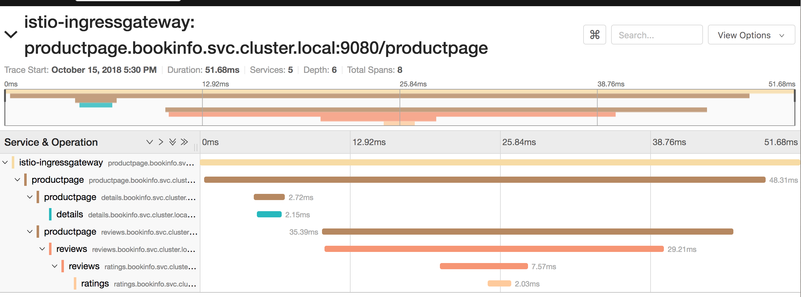
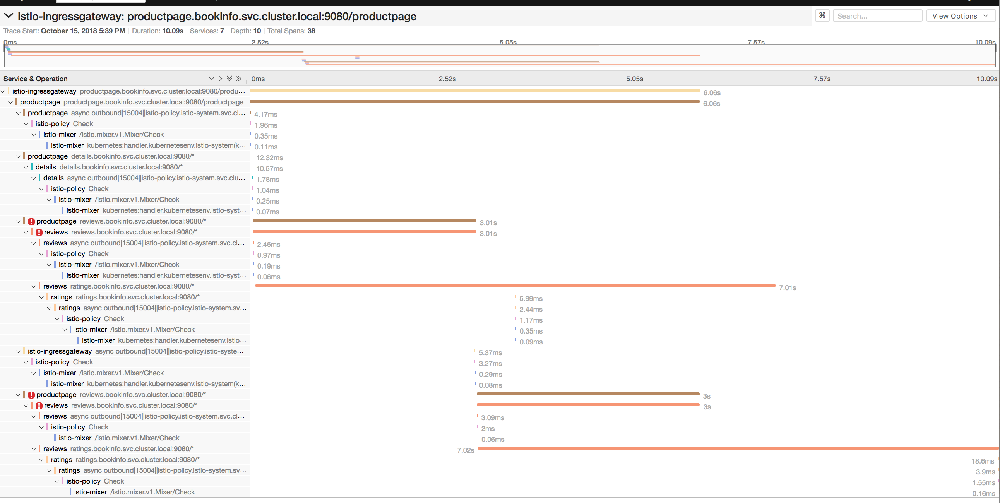
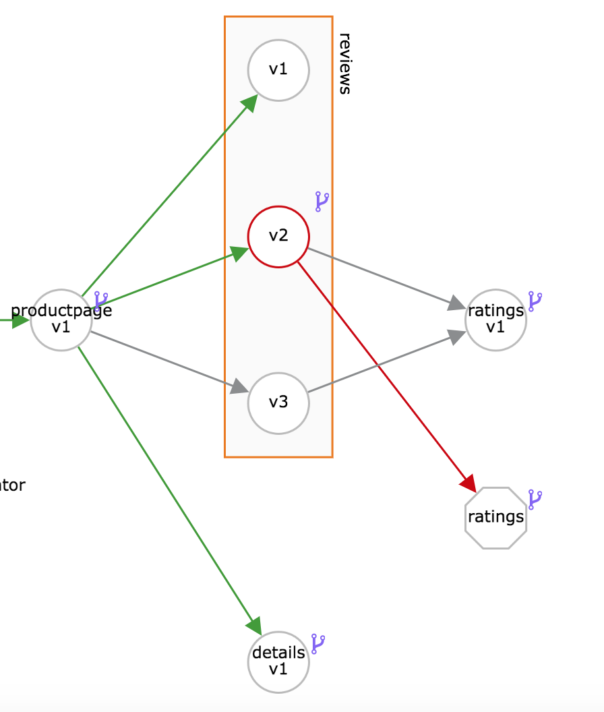

# Fault Injection
Fault injection is a mechanism where we will intentionally introduce a fault condition into a system and observe it's behavior.

In this example, we will observe what happens when we add some delay to mimic network latency into the ratings microservice. We will then observe the overall behavior of the system to check if still responds or will it cause failures other failures. 

### Pre-requisites

* A running Istio Cluster
* Sample BookInfo application deployed
* This is a followup after the [Request Routing Example](./RequestRouting.md). So if you haven't executed the test, you would want to 
	* create virtual services that would default to v1 i.e, `kubectl apply -f samples/bookinfo/networking/virtual-service-all-v1.yaml` 
	* content based routing for user jason to be redirected to v2 i.e, `kubectl apply -f samples/bookinfo/networking/virtual-service-reviews-test-v2.yaml` 
	 


## Verify the response times with No delay

Run the application a few times from the browser as user `jason`. You will notice in the Jaeager tracer, that the response time for the service is a few milliseconds 




## Inject Delay

Now let's introduce some delay on the ratings service specifically for user "Jason". This rule introduces a fixed delay of 7 seconds on the ratings service for any traffic coming from Jason. You will understand that we are introducing this delay using `httpFault`.

```
$ cat samples/bookinfo/networking/virtual-service-ratings-test-delay.yaml
apiVersion: networking.istio.io/v1alpha3
kind: VirtualService
metadata:
  name: ratings
spec:
  hosts:
  - ratings
  http:
  - match:
    - headers:
        end-user:
          exact: jason
    fault:
      delay:
        percent: 100
        fixedDelay: 7s
    route:
    - destination:
        host: ratings
        subset: v1
  - route:
    - destination:
        host: ratings
        subset: v1
```

Apply the delay by running

```
kubectl apply -f samples/bookinfo/networking/virtual-service-ratings-test-delay.yaml
```
and watch the virtual service for ratings updated

```
virtualservice.networking.istio.io/ratings configured
```

Now try accessing the application. The reviews part of the application fails with error "**Error Fetching Product Reviews**" as below:


Check Jaeger tracing now again to check the failures.




The detailed trace shows that ratings service responded in ~7 seconds. But the reviews service failed in ~3 seconds and then it went for a retry. Even during the retry ratings responded after ~7 seconds and the reviews failed. This is because the timeout between the productpage and reviews service is less (3s + 1 retry = 6s total) than the timeout between the reviews and ratings service (10s) as [hardcoded here](https://github.com/istio/istio/blob/master/samples/bookinfo/src/productpage/productpage.py#L231). 

Sign-out from "Jason" and test as a default user, the calls should go through fine with no errors.


### Edit Delay

Let's now edit the delay to 2.8 seconds on the ratings service to see

```
$ kubectl edit virtualservice ratings
```

Find this section in the editor
```
spec:
  hosts:
  - ratings
  http:
  - fault:
      delay:
        fixedDelay: 7s
        percent: 100
```

Change it to 

```
spec:
  hosts:
  - ratings
  http:
  - fault:
      delay:
        fixedDelay: 2.8s
        percent: 100
      
```
and save.

Test again signing in as user "jason". Black star ratings (reviews v2) should be back again. But you will notice a slight wait of <3 seconds. Also observe Jaeger traces to find that the ratings service uses ~2.8 seconds and the rest of the calls go through with no errors.

## Inject HTTP Abort Fault

We'll now introduce a HTTP Abort Fault to the `ratings` service for user `jason`.

Let us look at the fault we are adding. The following rule throws `httpStatus 500` for the ratings service when the user is `jason`.

```
$ cat samples/bookinfo/networking/virtual-service-ratings-test-abort.yaml
apiVersion: networking.istio.io/v1alpha3
kind: VirtualService
metadata:
  name: ratings
spec:
  hosts:
  - ratings
  http:
  - match:
    - headers:
        end-user:
          exact: jason
    fault:
      abort:
        percent: 100
        httpStatus: 500
    route:
    - destination:
        host: ratings
        subset: v1
  - route:
    - destination:
        host: ratings
        subset: v1
```

Apply this fault by running

```
kubectl apply -f samples/bookinfo/networking/virtual-service-ratings-test-abort.yaml
```

Test the application as a regular user. The output should show output with ratings not displaying any stars.

Now signin as user `jason` and run again. You will see a message that *`Ratings service is currently unavailable`*

You can also notice errors in Jaeger for the ratings service. Also note the service graph showing errors between `reviews` and `ratings` in red as shown below.



## Clean up

To clean up, remove the routing rules by deleting the virtual services created earlier.

```
kubectl delete -f samples/bookinfo/networking/virtual-service-all-v1.yaml
```
## Summary
In this lab, we have learnt to inject a fault by mimicing network latency and a http fault for a specific user and tested how the overall system behaves.