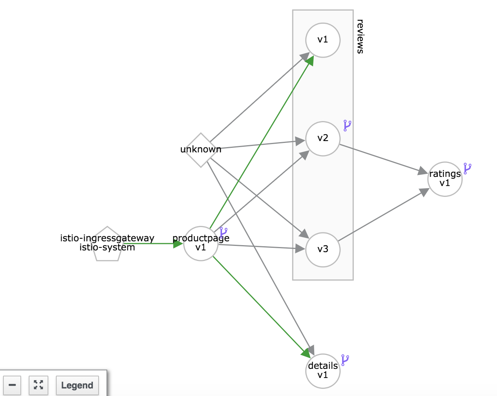

# Request Routing

### Prerequisites

* A running Istio Cluster
* Sample BookInfo Application deployed
* Destination rules created

## Routing all traffic to version 1
If you test the Bookinfo application in the browser. "Reviews" output is random each time you access the page.

* Sometimes it hits reviews v1 (No stars)
* Sometimes it hits reviews v2 (black stars)
* Sometimes it hits reviews v3 (red stars)

In this lab we will add virtualservices to route all the traffic to version 1. In order to accomplish this behavior,  we will apply the a set of virtual services to land traffic on `subset: v1`.  These subsets were defined while creating destination rules previously.  

> **Note** You can list the current destination rules by running `kubectl get destinationrules -o yaml`

```
$ cat samples/bookinfo/networking/virtual-service-all-v1.yaml
apiVersion: networking.istio.io/v1alpha3
kind: VirtualService
metadata:
  name: productpage
spec:
  hosts:
  - productpage
  http:
  - route:
    - destination:
        host: productpage
        subset: v1
---
apiVersion: networking.istio.io/v1alpha3
kind: VirtualService
metadata:
  name: reviews
spec:
  hosts:
  - reviews
  http:
  - route:
    - destination:
        host: reviews
        subset: v1
---
apiVersion: networking.istio.io/v1alpha3
kind: VirtualService
metadata:
  name: ratings
spec:
  hosts:
  - ratings
  http:
  - route:
    - destination:
        host: ratings
        subset: v1
---
apiVersion: networking.istio.io/v1alpha3
kind: VirtualService
metadata:
  name: details
spec:
  hosts:
  - details
  http:
  - route:
    - destination:
        host: details
        subset: v1
---

```

Let us apply the virtual services by running

```
kubectl apply -f samples/bookinfo/networking/virtual-service-all-v1.yaml
```
and watch for the following output

```
virtualservice.networking.istio.io/productpage created
virtualservice.networking.istio.io/reviews created
virtualservice.networking.istio.io/ratings created
virtualservice.networking.istio.io/details created
```

At this point you should see the following virtual services. The virtual service bookinfo was created previously and we just created the rest of them.

```
$ kubectl get virtualservice -n bookinfo
NAME          CREATED AT
bookinfo      13m
details       20s
productpage   20s
ratings       20s
reviews       20s
```

If you test the application now, the reviews part of the page displays with no rating stars, no matter how many times you refresh. This is because you configured Istio to route all traffic for the reviews service to the version reviews:v1 and this version of the service does not access the star ratings service.

To generate some data that can be visualized by support services, you can access the application in a loop. Open a new command line window.

* Save the URL as an environment variable

```
export URL=$(kubectl get virtualservice bookinfo -o yaml -o jsonpath={.spec.hosts[0]})
```

* Invoke application in a loop

```
while true; do curl -o /dev/null -s -w "%{http_code}\n" http://${URL}/productpage; sleep 2; done
```

If you now observe the service graph in Kiali, you will see green lines that show traffic only to version 1 as below:



Also watch the newly created services in `Istio-Config` menu in Kiali.

### Summary
We have added routing rules to redirect all the traffic by default to version 1.

## Canary - Route based on user identity

Let's now assume that we are adding Reviews service v2 as a canary and let us say we want to allow a specific user to use this service. Reviews v2 calls ratings service but displays the ratings as **black stars**.

Redirect specific user to `reviews version v2` based on the header content, i.e, end-user matching jason as shown below. Rest of the traffic will still flow to `reviews version v1`. Note how the subsets defined previously in the destination rules are being used here. 

```
$ cat samples/bookinfo/networking/virtual-service-reviews-test-v2.yaml
apiVersion: networking.istio.io/v1alpha3
kind: VirtualService
metadata:
  name: reviews
spec:
  hosts:
    - reviews
  http:
  - match:
    - headers:
        end-user:
          exact: jason
    route:
    - destination:
        host: reviews
        subset: v2
  - route:
    - destination:
        host: reviews
        subset: v1
```

Let us now update the virtual service `reviews` by applying this.

```
kubectl apply -f samples/bookinfo/networking/virtual-service-reviews-test-v2.yaml
```
and watch the following output

```
virtualservice.networking.istio.io/reviews configured
```

You can verify that the change is applied by running `kubectl get virtualservice reviews -o yaml` and checking the output.

Now in the browser access the application, click on `Signin` on the top right corner and login as user `jason`. (Password can be anything). As soon as you login you will see the reviews with **black stars** i.e., reviews version v2. Logout and try again to see **no stars**. 


Try it a few times and have fun :)

### Summary
Assume you created a new version of reviews service v2 and you want to test it as specific user before releasing it or making it generally available. You introduce it as a canary to specific user to test. 


### Cleanup

> **Note** If you want to continue to the next lab, this clean up is not required. 

To clean up all the virtual services we added, remove them using the following command

```
kubectl delete -f samples/bookinfo/networking/virtual-service-all-v1.yaml
```

Once you clean up these rules, the traffic should now be distributed to all versions and hence you should be randomly seeing **no stars**, **black stars** and **red stars**.

