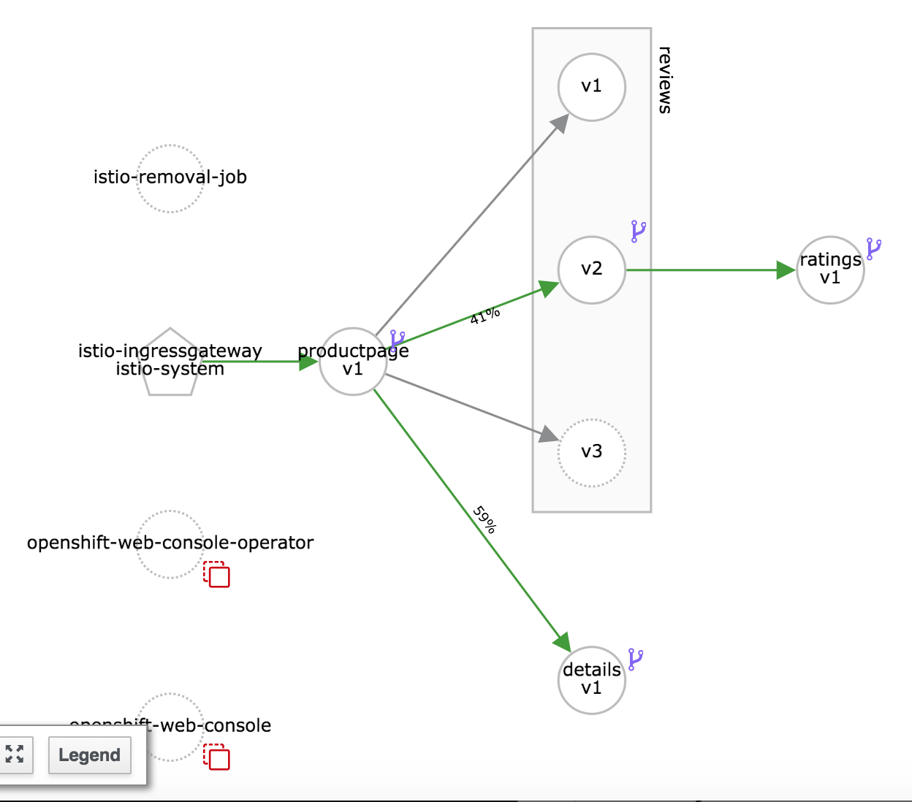
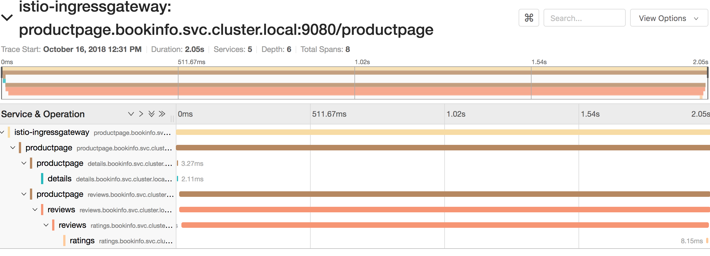
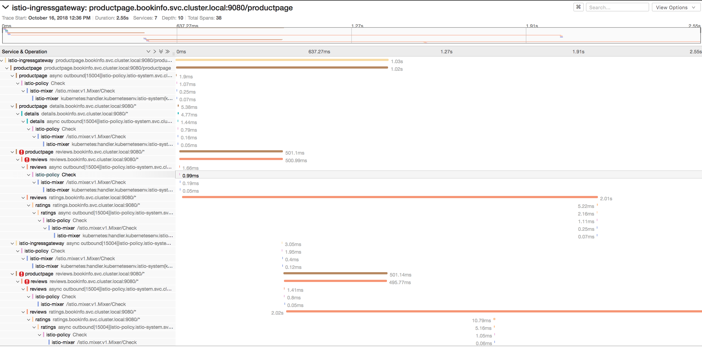

# Request timeouts

In this exercise we will learn to to introduce timeouts using Routing rules.


### Pre-requisites
* A running Istio Cluster
* Sample BookInfo application deployed 
* Create virtual services that would default to v1 i.e, `kubectl apply -f samples/bookinfo/networking/virtual-service-all-v1.yaml` 

## Add Request Time Out

We'll change the default reviews virtual service to redirect the traffic to reviews version v2 as below:

```
cat <<EOF | kubectl apply -f -
apiVersion: networking.istio.io/v1alpha3
kind: VirtualService
metadata:
  name: reviews
spec:
  hosts:
    - reviews
  http:
  - route:
    - destination:
        host: reviews
        subset: v2
EOF
```


If you test it now you will see all requests going to reviews v2 (black stars)
Note the response time for ratings service and reviews service in Jaeger it will be a few milliseconds.



Let's introduce **2 sec delay** for the ratings service as in our [Fault Injection](./FaultInjection.md) exercise but for all the users (not just Jason). Note that the delay in this case is 2s which is still less than the timeout of 3s between product page and reviews page.


```
cat <<EOF | kubectl apply -f -
apiVersion: networking.istio.io/v1alpha3
kind: VirtualService
metadata:
  name: ratings
spec:
  hosts:
  - ratings
  http:
  - fault:
      delay:
        percent: 100
        fixedDelay: 2s
    route:
    - destination:
        host: ratings
        subset: v1
EOF
```

Now if you test you will see that the there is a 2 sec wait for the response.
Note the response time for ratings service in Jaeger. It would have gone up from milliseconds measured earlier to over 2 seconds now. But the call is still successful. 



By default, the timeout for http requests is **15 seconds**, but this can be overridden in a route rule. 


Now let's override the default 15 sec with a **0.5 sec** timeout for the reviews service. 

```
cat <<EOF | kubectl apply -f -
apiVersion: networking.istio.io/v1alpha3
kind: VirtualService
metadata:
  name: reviews
spec:
  hosts:
  - reviews
  http:
  - route:
    - destination:
        host: reviews
        subset: v2
    timeout: 0.5s
EOF
```

While the application timeout between the product page and reviews page is 3s, the above change will override that via routing rule and the lowest (1s) takes precedence. Now the Reviews part of the page gives an error

```
Error fetching product reviews!

Sorry, product reviews are currently unavailable for this book.
```

You can also see in Jaeger that the reviews calls ratings and timesout in approximately 500ms.  Reviews is retried once and times out in 500ms while waiting for ratings.



## Cleanup 

To clean up, remove the routing rules by deleting the virtual services created earlier.

```
kubectl delete -f samples/bookinfo/networking/virtual-service-all-v1.yaml
```

## Summary

In this exercise, we learnt to change the request timeouts for services using side cars from the default **15 sec** time out to a value of our choice.