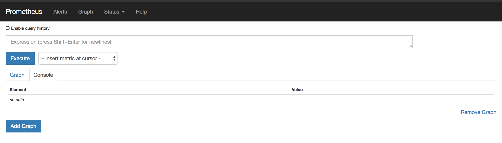
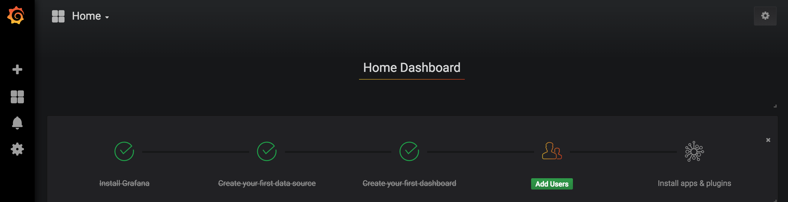
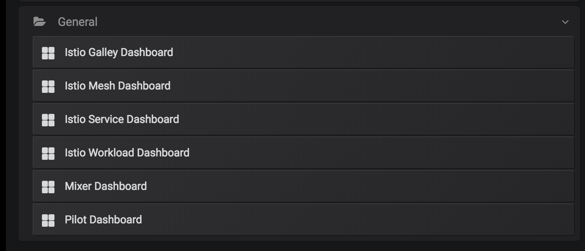
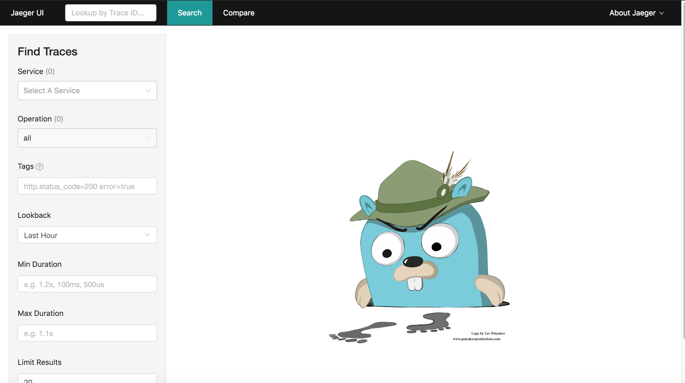
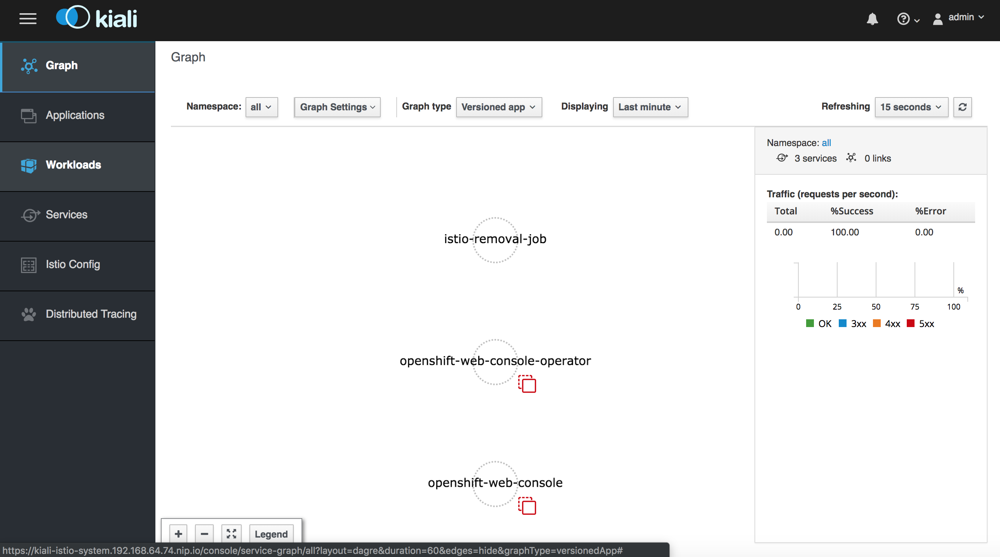

# Using Istio Supporting Services

### Prerequisites

* A running Openshift cluster with Istio installed by the installer

### Introduction
OpenShift installer also includes a bunch of supporting services that it installed. These are:

* **Prometheus** for monitoring and metrics data collection and querying
* **Grafana** that provides dashboards for monitoring data collected by prometheus
* **Kiali** for observability of your microservices running on an Istio Cluster
* **Jaeger** for distributed tracing of your microservices

Running `kubectl get routes -n istio-system` lists all the endpoints exposed for reaching these supporting services. We have also seen the corresponding pods running in the previous chapter. 

> **Note** OpenShift installer automagically setup all these for you!! You don't need to go through extra steps to setup supporting services.

````
$ kubectl get route -n istio-system
NAME                   HOST/PORT                                                PATH      SERVICES               PORT              TERMINATION   WILDCARD
grafana                grafana-istio-system.192.168.64.72.nip.io                          grafana                http                            None
istio-ingressgateway   istio-ingressgateway-istio-system.192.168.64.72.nip.io             istio-ingressgateway   http2                           None
jaeger-query           jaeger-query-istio-system.192.168.64.72.nip.io                     jaeger-query           jaeger-query      edge          None
kiali                  kiali-istio-system.192.168.64.72.nip.io                            kiali                  http-kiali        reencrypt     None
prometheus             prometheus-istio-system.192.168.64.72.nip.io                       prometheus             http-prometheus                 None
tracing                tracing-istio-system.192.168.64.72.nip.io                          tracing                tracing           edge          None
```` 

### Prometheus

You can access prometheus using the route exposed for prometheus. In my case it is [http://prometheus-istio-system.192.168.64.72.nip.io](http://prometheus-istio-system.192.168.64.72.nip.io/graph)



You can select metrics, create expressions and Execute. You can also view data in graphical form.

### Grafana

You can access prometheus using the route exposed for prometheus. In my case it is [http://grafana-istio-system.192.168.64.72.nip.io/graph](http://grafana-istio-system.192.168.64.72.nip.io/graph). 



Istio provides a set of dashboards by default, you can select each one of them to view the metrics it displays in a graphical form.


### Jaeger
Jaeger provides distributed tracking on microservices (observability) are connecting to each other. You can access Jaeger using the route exposed. In my case it is
[https://jaeger-query-istio-system.192.168.64.74.nip.io](https://jaeger-query-istio-system.192.168.64.74.nip.io]

You will see the Jaeger console as below. Once we deploy an application and run, you will start seeing some content here. 



### Kiali
Openshift uses Kiali for observability using service graph representation, distributed tracing, metrics collection and graphs, configuration validation, Health computation and display, service discovery etc

You can access Kiali using the route exposed. In my case it is [https://kiali-istio-system.192.168.64.74.nip.io/](https://kiali-istio-system.192.168.64.74.nip.io/)

It will prompt you to login to Kiali, and you can use `admin/admin` as credentials for now. Once you log in it shows the console as shown below. 



Navigate and familiarize with all these supporting tools. We will be use these as required once we deploy sample applications.
